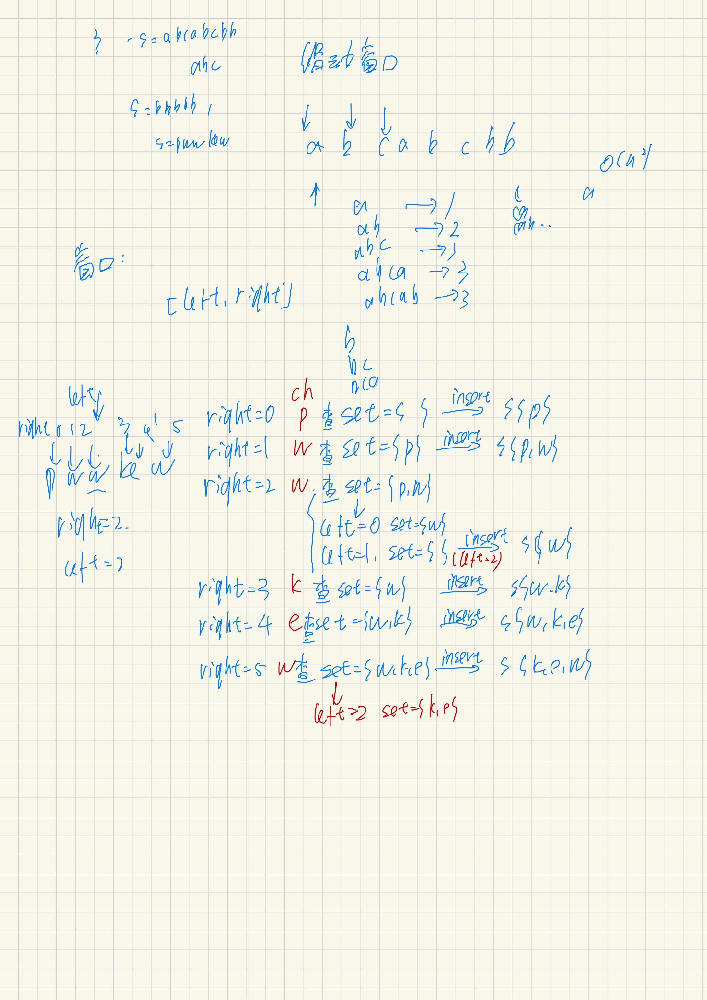

## 题单

| 题号 | 题目 | 难度 | 关键点 |
|------|------|------|--------|
| LC 3 | 最长无重复子串 | 中 | HashSet 判重，变长窗口 |
| LC 209 | 长度最小的子数组 | 中 | 窗口和 ≥ target 就收缩 |
| LC 438 | 找所有字母异位词 | 中 | 固定窗口 + 频率数组比较 |
| LC 567 | 字符串的排列 | 中 | 同 438，判断是否含异位词 |

进阶：[LC 76（最小覆盖子串）](/internship/hot76-minimum-window-substring)、LC 239（滑动窗口最大值）。建议顺序：**3 → 209 → 438 → 567 → 76 → 239**。

---

## LC 3. 最长无重复字符子串

**模板：变长窗口**。right 滑动扩张，遇到重复字符就收缩 left。

```cpp
class Solution {
public:
    int lengthOfLongestSubstring(string s) {
        set<char> str;
        int len = 0, left = 0;
        for (int right = 0; right < s.size(); right++) {
            while (str.count(s[right])) {
                str.erase(s[left]);
                left++;
            }
            str.insert(s[right]);
            len = max(len, right - left + 1);
        }
        return len;
    }
};
```

注意 `len` 要用 `max` 更新，不能直接写 `len = right - left + 1`——比如 `pwwkew`，遍历到第二个 `w` 时窗口收缩成 `w`，但历史最大值是 `pw`（2），直接赋值会丢失。



本质就是用一个 set 当作"内存"，里面保存当前窗口里不重复的字符。暴力是 O(n²)，滑动窗口只需一次遍历 O(n)。

---

## LC 209. 长度最小的子数组

**变长窗口**，right 扩张累加，一旦 sum ≥ target 就收缩 left 并记录长度。

```cpp
class Solution {
public:
    int minSubArrayLen(int target, vector<int>& nums) {
        int left = 0, sum = 0, len = INT_MAX;
        for (int right = 0; right < nums.size(); right++) {
            sum += nums[right];
            while (sum >= target) {
                len = min(right - left + 1, len);
                sum -= nums[left];
                left++;
            }
        }
        return len == INT_MAX ? 0 : len;
    }
};
```

---

## LC 438. 找到字符串中所有字母异位词

**定长窗口**，窗口长度固定为 `p.size()`，用频率数组代替 sort 比较。

```cpp
class Solution {
public:
    vector<int> findAnagrams(string s, string p) {
        int len = p.size();
        vector<int> tag;
        vector<int> pCount(26, 0), sCount(26, 0);
        for (char ch : p) pCount[ch - 'a']++;

        int left = 0;
        for (int right = 0; right < s.size(); right++) {
            sCount[s[right] - 'a']++;
            if (right - left + 1 == len) {
                if (pCount == sCount) tag.push_back(left);
                sCount[s[left] - 'a']--;
                left++;
            }
        }
        return tag;
    }
};
```

频率数组相当于一个小哈希表，但比 `unordered_map` 快（数组的 O(1) 比哈希的 O(1) 常数更小）。数组大小固定为 26 才能用 `==` 直接比较。

---

## LC 567. 字符串的排列

和 438 几乎一样，只是返回 bool 而不是所有起始下标。

```cpp
class Solution {
public:
    bool checkInclusion(string s1, string s2) {
        int len = s1.size(), left = 0;
        vector<int> s1count(26, 0), s2count(26, 0);
        for (char ch : s1) s1count[ch - 'a']++;

        for (int right = 0; right < s2.size(); right++) {
            s2count[s2[right] - 'a']++;
            if (right - left + 1 == len) {
                if (s1count == s2count) return true;
                s2count[s2[left] - 'a']--;
                left++;
            }
        }
        return false;
    }
};
```

---

## 两种模板对比

| 类型 | 收缩条件 | 代表题 |
|------|----------|--------|
| 变长窗口 | 不满足条件时收缩 left | LC 3、LC 209 |
| 定长窗口 | 窗口到达固定长度后移动 left | LC 438、LC 567 |

定长窗口是 `if(right - left + 1 == len)` 后立刻移动 left；变长窗口是 `while(不满足)` 收缩。吃透这两个模板，后面的变形题都是套路。
