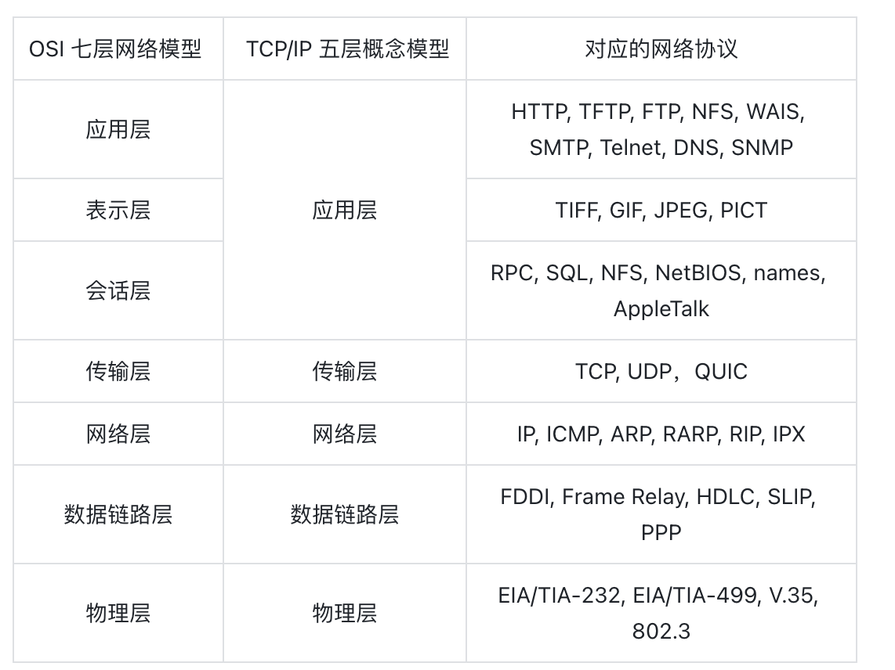
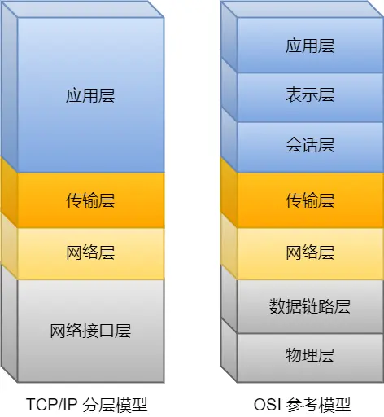
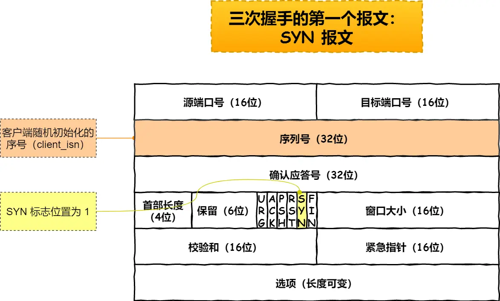
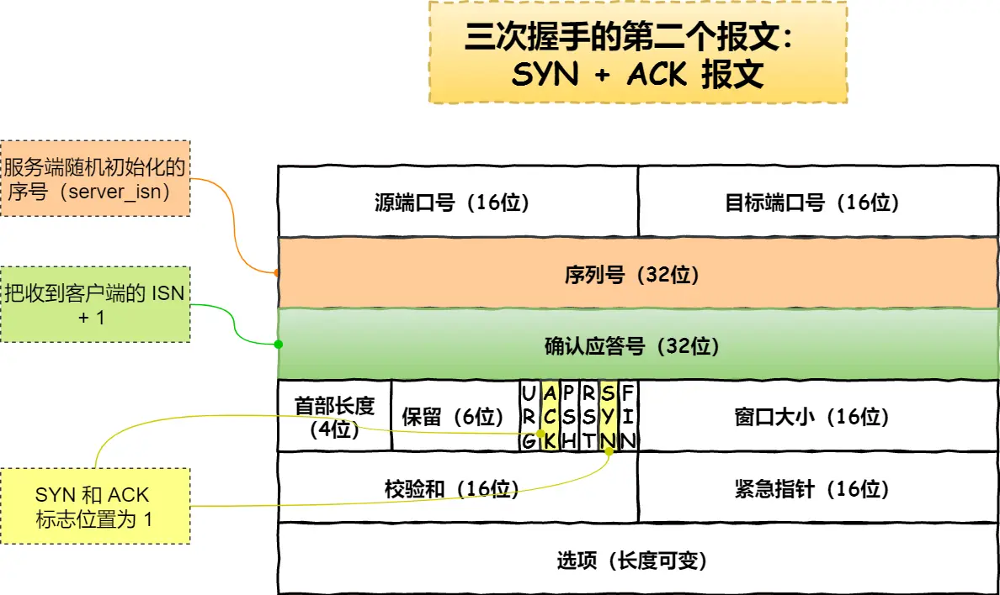
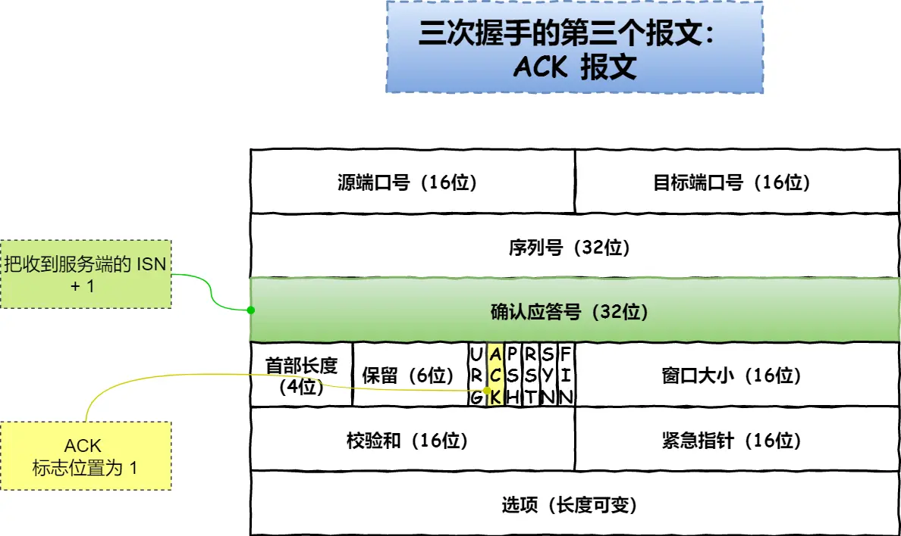
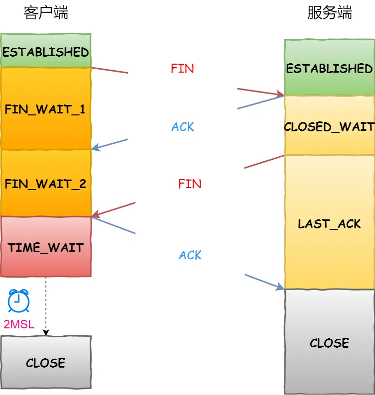

## OSI 与 TCP/IP 分层

OSI 把网络分成 7 层，从上到下依次是：应用层、表示层、会话层、传输层、网络层、数据链路层、物理层。

TCP/IP 把功能相似的层合并，从上到下只有 4 层：应用层、传输层、网络层、网络接口层。

---

## TCP 是什么

TCP 是**面向连接的、可靠的、基于字节流的**传输层协议。这三个词各有含义：

- **面向连接**：必须一对一建立连接，不支持一对多（UDP 可以）
- **可靠的**：无论网络怎么变，TCP 保证数据一定到达接收端
- **字节流**：数据可能被操作系统拆成多个 TCP 报文；因为报文有序，如果前面的没到，后面的也不会先处理

TCP 连接由三个元素唯一确定：**Socket（IP+端口）、序列号、窗口大小**。

> The combination of this information, including sockets, sequence numbers, and window size, is called a connection.

TCP **四元组**（源 IP、源端口、目的 IP、目的端口）唯一确定一条连接。端口在 TCP 头部里，IP 地址在网络层头部里。

**一个 IP 的服务端最多能建多少 TCP 连接？**  
理论上限 = 客户端 IP 数 × 客户端端口数 = 2³² × 2¹⁶。但实际受文件描述符（每个连接对应一个 fd）和内存限制，远达不到理论值。

---

## TCP vs UDP

| 维度 | TCP | UDP |
|------|-----|-----|
| 连接 | 面向连接（三次握手） | 无连接，即时发送 |
| 服务对象 | 一对一 | 一对一、一对多、多对多 |
| 可靠性 | 可靠，无差错、无丢失、按序到达 | 不可靠，丢了就丢了 |
| 拥塞/流量控制 | 有 | 无，网络再堵也不影响发送速率 |
| 首部开销 | 最小 20 字节，有选项时更长 | 固定 8 字节 |
| 传输方式 | 字节流，无边界，保证顺序 | 一包一包发，有边界，可能乱序丢包 |
| 分片层级 | 传输层分片（按 MSS），丢一片重传一片 | IP 层分片（按 MTU），IP 层组装后交传输层 |

**应用场景：**
- TCP：FTP 文件传输、HTTP/HTTPS
- UDP：DNS、SNMP、视频/音频流、广播（如 QUIC 也是基于 UDP 实现的可靠协议）

**为什么 UDP 头部没有首部长度字段？** 因为 UDP 头部固定 8 字节，不需要标识长度；TCP 有可变长的选项字段，所以需要。

---

## 三次握手

建立连接需要三次握手，目的是初始化双方的序列号（ISN）并避免历史连接干扰。

**第一次握手（客户端 → 服务端）**

客户端发送 SYN，携带自己的初始序列号 `client_isn`，状态变为 `SYN_SENT`。服务端收到后从 `LISTEN` 变为 `SYN_RCVD`。

**第二次握手（服务端 → 客户端）**

服务端回复 `SYN + ACK`：
- `Ack Num = client_isn + 1`（确认客户端的 ISN）
- `Seq Num = server_isn`（自己的 ISN）

客户端收到后状态从 `SYN_SENT` 变为 `ESTABLISHED`。

**第三次握手（客户端 → 服务端）**

客户端发送 `ACK = server_isn + 1`，确认服务端的 ISN。服务端收到后从 `SYN_RCVD` 变为 `ESTABLISHED`。

前两次握手不能携带数据，第三次可以。

### 为什么是三次而不是两次？

**原因一：阻止历史连接**

假设你先发了 SYN=90（被网络堵住），又发了 SYN=100。服务端先收到 90，回了 `ACK=91`。客户端收到 91，发现不是期望的 101，于是发 RST 切断这个连接，服务端回到 LISTEN 状态。之后 100 到达，正常建立连接。

如果只有两次握手，客户端无法在第三步发送 RST，服务端就会一直挂在半开连接状态，被旧包占用资源——这正是 SYN Flood 攻击的原理。

**原因二：双向同步 ISN**

TCP 是全双工，双方各自有 ISN，需要互相确认：
- 第一次：服务端收到并确认了客户端的 ISN
- 第二次：服务端发出自己的 ISN
- 第三次：客户端确认了服务端的 ISN

两次握手缺少第三步，客户端无法确认服务端的 ISN，排序和校验都无法进行。

**原因三：避免资源浪费**

两次握手时，服务端收到 SYN 就认为连接建立，但客户端可能根本没收到服务端的 SYN-ACK，导致服务端白白占用资源。

### ISN 怎么生成？

按 RFC 793：`ISN = m + f(src_ip, dst_ip, src_port, dst_port)`，m 是每 4 微秒加 1 的计时器，f 是 MD5 哈希函数，防止外部推算。

### 第一次握手丢失后的重传

超时时间呈指数退避：1s → 2s → 4s → 8s → 16s。这和 Langfuse 的重试机制设计原理一样——错开时间是为了防止大量客户端同时超时时涌入的流量把服务端再次打垮（类似错峰访问）。

---

## 四次挥手

断开连接需要四次挥手。我觉得这个过程特别像关电脑：

**第一次挥手（客户端 → 服务端）**  
客户端发 FIN，状态变为 `FIN_WAIT_1`，表示"我要关了"。

**第二次挥手（服务端 → 客户端）**  
服务端回 ACK，表示"收到了，我还有数据要处理"，状态变为 `CLOSE_WAIT`。客户端收到后进入 `FIN_WAIT_2`。

**第三次挥手（服务端 → 客户端）**  
服务端把该保存的数据保存完，该退出的进程退出后，发送 FIN，表示"我也准备关了"。

**第四次挥手（客户端 → 服务端）**  
客户端回 ACK，状态变为 `TIME_WAIT`，等待 2MSL 后自动关闭。服务端收到 ACK 后直接关闭。

### TIME_WAIT 等 2MSL 的作用

不只是"等一下"，有两个具体目的：

1. **防止最后一个 ACK 丢失**：如果客户端的 ACK 丢了，服务端会重传 FIN；客户端在 TIME_WAIT 期间能重新回 ACK，不至于服务端永远收不到确认。
2. **清除网络中的残留包**：确保本次连接的所有报文都在网络里失效，避免新连接（相同四元组）误收到旧连接的"幽灵包"。

2MSL = 两倍最大报文生存时间，理论上足够让所有旧包消亡。
